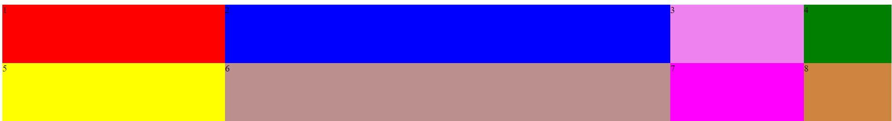

# Instrukcje

1. Stwórz siatkę składającą się z 3 kolumn i 2 wierszy.
2. Jako wypełnienie użyj divów z index.html.
3. Kolumny powinny mieć szerokość 25% 50% 15% 10%.
4. Wiersze powinny mieć wysokość 100px.
5. Końcowy efekt powinien wyglądać tak jak na screenie poniżej:

