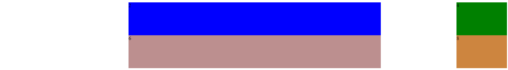

# Instrukcje

1. Usuń z pliku index.html nieparzyste divy (.div1, .div3 itd). 
2. Zmodyfikuj style pozostałych elementów w taki sposób by pozostały one w tym samym miejscu, co przed usunięciem elementów z kroku 1
3. Finalnie efekt powinien być następujący:

