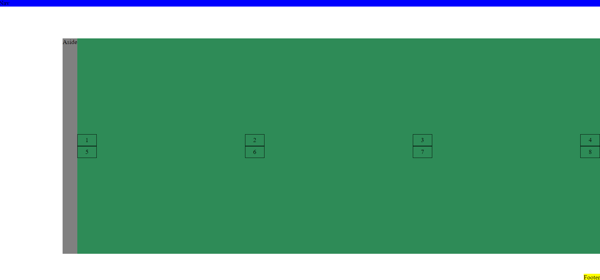

# Instrukcje

1. Zmodyfikuj layout tak, aby wyglądał tak jak na zamieszczonym obrazku
2. navigacja rozciągnięta od lewej do prawej, w pionie pozycjonowana do górnej krawędzi
3. aside w poziomie pozycjonowany do prawej krawędzi, w pionie rozciągniety na całą wysokość
4. footer w poziomie pozycjonowany do prawej krawędzi, w pionie do dolnej krawędzi
5. zawartość main, grid 2 wiersze, 4 kolumny, kolumna o szerkości 50px, w pionie wyśrodkowana, w poziomie dostępna szerokość podzielona po równo pomiędzy elementy, skrajne elementy przyklejone do krawędzi
